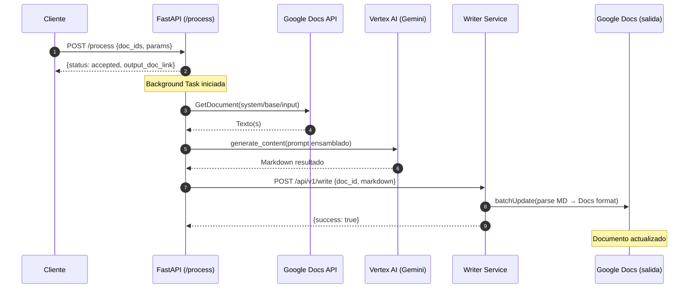
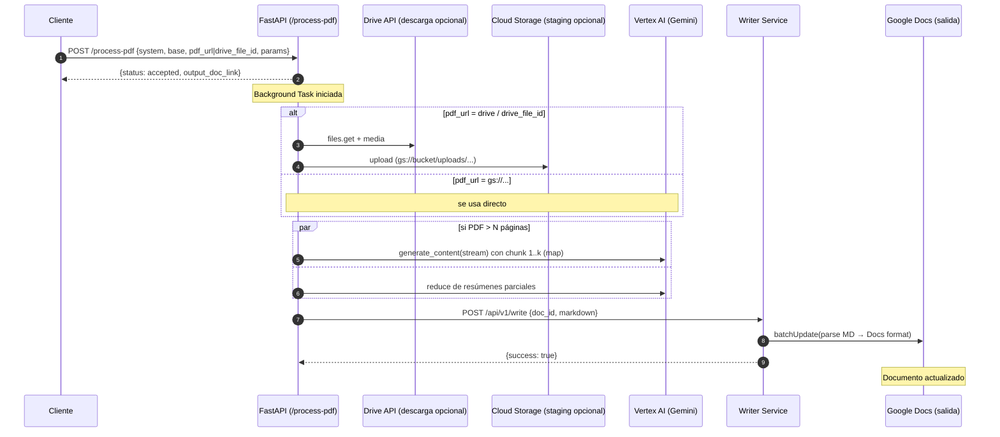

---

# brain — API de Procesamiento de Documentos (FastAPI + Vertex AI + Google Docs)

> Orquesta: **Docs/PDF → Gemini → Markdown → Writer Service → Doc de salida**. Desplegable en **Cloud Run**.

---

# 📦 Características

* **Endpoints asíncronos**
  * `POST /process` → *Input:* **Google Doc** (por ID) - procesamiento en background
  * `POST /process-pdf` → *Input:* **PDF** (Drive o `gs://`) con *map-reduce* opcional - procesamiento en background
* **Arquitectura de microservicios desacoplada**
  * Procesamiento de documentos con Gemini (Vertex AI)
  * **Integración con Writer Service externo** para escritura Markdown → Google Docs
  * Separación de responsabilidades: Brain (procesamiento IA) + Writer Service (escritura a Docs)
* **Clientes centralizados con caché** (Drive, Docs, Vertex, GCS) + **reintentos robustos** (TLS/EOF/5xx/cuotas)
* **Soporte ADC/SA JSON** (local y Cloud Run) con scopes mínimos Workspace
* **Logs estructurados** y errores claros
* **Configuración por entorno** vía `.env` / variables de entorno
* **Background tasks** con FastAPI para procesamiento asíncrono real

---

## 🗂️ Estructura del repo

```
brain/
├── src/
│   ├── api/
│   │   ├── routes.py          # Endpoints /process y /process-pdf
│   │   ├── schemas.py         # Modelos Pydantic de request/response
│   │   ├── health.py          # Healthcheck endpoint
│   │   └── whoami.py          # Identity endpoint
│   ├── clients/
│   │   ├── drive_client.py    # Cliente Google Drive con reintentos
│   │   ├── gdocs_client.py    # Cliente Google Docs (lectura)
│   │   ├── vertex_client.py   # Cliente Vertex AI (Gemini)
│   │   ├── gcs_client.py      # Cliente Google Cloud Storage
│   │   ├── sheets_client.py   # Cliente Google Sheets
│   │   └── writer_api_client.py  # Cliente HTTP para Writer Service
│   ├── services/
│   │   ├── processing.py      # Lógica de procesamiento de Docs
│   │   └── pdf_processing.py  # Lógica de procesamiento de PDFs
│   ├── utils/
│   │   ├── logger.py          # Logger estructurado
│   │   └── md2gdocs.py        # Parser Markdown → Google Docs (legado)
│   ├── auth.py                # Autenticación Google (ADC/SA)
│   ├── main.py                # FastAPI app principal
│   └── settings.py            # Configuración centralizada
├── tests/                     # Pruebas de integración y unitarias
│   ├── assert_access.py
│   ├── drive_download.py
│   ├── gcs_upload.py
│   ├── vertex_text.py
│   ├── vertex_with_file.py
│   ├── docs_read.py
│   ├── docs_write_*.py
│   └── auth.py
├── requirements.txt
└── Dockerfile
```

---

## 🧠 Arquitectura

### 1) Flujo /process (Docs → Gemini → Writer Service → Doc)



### 2) Flujo /process-pdf (PDF → Gemini → Writer Service → Doc)



---

## 🔧 Configuración

### Variables de entorno (`.env` o Cloud Run)

| Variable                                | Ejemplo / Default                                              | Descripción                                               |
| --------------------------------------- | -------------------------------------------------------------- | --------------------------------------------------------- |
| `ENVIRONMENT`                           | `local` / `run`                                                | Comportamiento de logs y clientes                         |
| `LOG_LEVEL`                             | `INFO`                                                         | Nivel de logging                                          |
| `GCP_PROJECT_ID`                        | `ortega-473114`                                                | Proyecto GCP                                              |
| `GCP_LOCATION`                          | `us-central1`                                                  | Región Vertex/Run                                         |
| `SA_EMAIL`                              | `gctest@...iam.gserviceaccount.com`                            | SA para grants opcionales                                 |
| `GOOGLE_APPLICATION_CREDENTIALS`        | `/secrets/sa.json` *(local)*                                   | Ruta a SA JSON *(local)*                                  |
| `VERTEX_MODEL_ID`                       | `gemini-2.5-flash`                                             | Modelo por defecto                                        |
| `SHARED_FOLDER_ID`                      | *(opcional)*                                                   | Carpeta compartida (Workspace)                            |
| **`PDF_STAGING_BUCKET`**                | `my-bucket-out`                                                | **Bucket GCS** para staging de PDFs                       |
| **`PDF_MAX_PAGES_PER_CHUNK`**           | `60`                                                           | Páginas por chunk (map)                                   |
| **`PDF_USE_FILE_API`**                  | `true` / `false`                                               | `true` registra en Files API; `false` usa `gs://` directo |
| **`WRITER_SERVICE_URL`**                | `https://m2gdw-...run.app/api/v1/write`                        | **URL del servicio externo de escritura a Docs**          |
| *(opcional)* `DOCS_TEXT_CHUNK`          | `50000`                                                        | Tamaño de chunk de escritura (legacy, ya no usado)        |
| *(opcional)* `DOCS_TEXT_CHUNK_SLEEP_MS` | `150`                                                          | Pausa (ms) entre chunks (legacy, ya no usado)             |
| *(opcional)* `APP_VERSION`              | `dev`                                                          | Versión de la aplicación                                  |

### Creación de bucket e IAM (una vez)

```bash
gcloud services enable storage.googleapis.com

# 1) Crear bucket (¡sin sufijos tipo /pdf!)
gcloud storage buckets create gs://my-bucket-out \
  --project=ortega-473114 --location=us-central1 --uniform-bucket-level-access

# 2) Conceder al servicio que corre la API (SA del servicio)
gcloud storage buckets add-iam-policy-binding gs://my-bucket-out \
  --member=serviceAccount:gctest@ortega-473114.iam.gserviceaccount.com \
  --role=roles/storage.objectCreator
gcloud storage buckets add-iam-policy-binding gs://my-bucket-out \
  --member=serviceAccount:gctest@ortega-473114.iam.gserviceaccount.com \
  --role=roles/storage.objectViewer

# 3) (Recomendado) permitir lectura al Vertex Service Agent si usas gs:// directo
PROJECT_NUMBER=$(gcloud projects describe ortega-473114 --format='value(projectNumber)')
gcloud storage buckets add-iam-policy-binding gs://my-bucket-out \
  --member=serviceAccount:service-${PROJECT_NUMBER}@gcp-sa-aiplatform.iam.gserviceaccount.com \
  --role=roles/storage.objectViewer
```

---

## ▶️ Ejecución local

1. Instalar dependencias

```bash
pip install -r requirements.txt
```

2. Autenticación

* **ADC**: `gcloud auth application-default login`
* **SA JSON**: `export GOOGLE_APPLICATION_CREDENTIALS=/ruta/sa.json`

3. Levantar

```bash
uvicorn src.main:app --reload --port 8080
```

---

## 📡 Endpoints

### `POST /process`

**Body (JSON)**

```json
{
  "system_instructions_doc_id": "DOC_ID",
  "base_prompt_doc_id": "DOC_ID",
  "input_doc_id": "DOC_ID",
  "output_doc_id": "DOC_ID",
  "additional_params": { "modo": "resumen_bullets" }
}
```

**Respuesta (200)**

```json
{
  "status": "accepted",
  "message": "Proceso de auditoría iniciado en segundo plano. El resultado aparecerá en el documento de salida una vez finalizado.",
  "output_doc_link": "https://docs.google.com/document/d/<OUTPUT_ID>/edit"
}
```

**Notas:**
- La respuesta es **inmediata** (status: `accepted`)
- El procesamiento ocurre en **background task**
- Revisa el documento de salida para ver el resultado cuando termine

### `POST /process-pdf`

**Body (JSON)**

```json
{
  "system_instructions_doc_id": "DOC_ID",
  "base_prompt_doc_id": "DOC_ID",
  "pdf_url": "https://drive.google.com/file/d/<FILE_ID>/view?usp=sharing",
  "drive_file_id": "FILE_ID (opcional, acelera acceso)",
  "output_doc_id": "DOC_ID",
  "additional_params": {
    "objetivo": "responder preguntas de regreso",
    "formato_salida": "bullets",
    "max_bullets": 6,
    "tono": "ejecutivo"
  }
}
```

> También puedes pasar `pdf_url` como `gs://my-bucket-out/uploads/2025/10/31/archivo.pdf` si ya lo subiste.

**Respuesta (200)**

```json
{
  "status": "accepted",
  "message": "Proceso de PDF iniciado en segundo plano.",
  "output_doc_link": "https://docs.google.com/document/d/<OUTPUT_ID>/edit"
}
```

**Notas:**
- La respuesta es **inmediata** (status: `accepted`)
- El procesamiento ocurre en **background task**
- Revisa el documento de salida para ver el resultado cuando termine

**Ejemplo `curl` (Cloud Run)**

```bash
curl -i -X POST "https://<SERVICE>.run.app/process-pdf" \
  -H "Content-Type: application/json" \
  -d '{
    "system_instructions_doc_id": "1WLo-...5ERY",
    "base_prompt_doc_id": "1t024Ow48Z60...mswOw",
    "pdf_url": "https://drive.google.com/file/d/16SQKPpAQiw2-sWQAqXw_-4ZyigE0OdSn/view?usp=sharing",
    "drive_file_id": "16SQKPpAQiw2-sWQAqXw_-4ZyigE0OdSn",
    "output_doc_id": "1-jESPLbKj2j_J7NGDT5UXtET40W2-idhCNcKm2WcuCs",
    "additional_params": { "objetivo":"responder preguntas de regreso", "formato_salida":"bullets" }
  }'
```

---

## 🚀 Despliegue en Cloud Run

### Build & Deploy

```bash
gcloud builds submit --tag us-central1-docker.pkg.dev/PROJECT_ID/ai/brain:latest

gcloud run deploy brain \
  --image us-central1-docker.pkg.dev/PROJECT_ID/ai/brain:latest \
  --service-account=SA_EMAIL \
  --region=us-central1 --platform=managed --allow-unauthenticated \
  --memory=1Gi --cpu=1 --concurrency=60 --timeout=720 \
  --min-instances=0 --max-instances=20 \
  --set-env-vars="ENVIRONMENT=run,LOG_LEVEL=INFO,GCP_PROJECT_ID=PROJECT_ID,GCP_LOCATION=us-central1,VERTEX_MODEL_ID=gemini-2.5-flash,SA_EMAIL=SA_EMAIL,PDF_STAGING_BUCKET=my-bucket-out,PDF_MAX_PAGES_PER_CHUNK=60,PDF_USE_FILE_API=true,WRITER_SERVICE_URL=https://m2gdw-YOUR_PROJECT.us-central1.run.app/api/v1/write"
```

> Ajusta `--timeout` según el tamaño de PDFs (recomendado 600–900s para procesos largos).

---

## ✅ Pruebas rápidas (CLI)

```bash
python -m tests.assert_access --file-id <FILE_ID> --mode drive
python -m tests.drive_download --file-id <FILE_ID>
python -m tests.gcs_upload
python -m tests.vertex_text
python -m tests.vertex_with_file
python -m tests.docs_read --doc-id <DOC_ID>
python -m tests.docs_write_small --doc-id <DOC_ID>
python -m tests.docs_write_big --doc-id <DOC_ID> --mb 0.2
python -m tests.docs_write_stress --doc-id <DOC_ID> --runs 5
```

---

## 🔐 Seguridad & permisos

* Scopes mínimos: `drive`, `documents`, `spreadsheets`, `cloud-platform`
* Comparte los Docs/Carpetas con la **Service Account** del servicio
* GCS: `roles/storage.objectCreator` + `roles/storage.objectViewer` para tu **SA**
  y `roles/storage.objectViewer` para el **Vertex Service Agent** (lectura `gs://`)

> **Tip**: Evita exponer `sa.json`. Usa Secret Manager o ADC en Cloud Run.

---

## 🧩 Troubleshooting (casos reales)

* **Background task no completa / timeout**
  → El endpoint retorna inmediatamente (`status: accepted`), pero la tarea corre en background.
  Revisa los logs del servicio Brain para ver el progreso real del procesamiento.

* **Error de conexión con Writer Service**
  → Verifica que `WRITER_SERVICE_URL` esté configurado correctamente.
  → Verifica que el Writer Service esté desplegado y accesible.
  → Revisa los logs del Writer Service para errores de autenticación o permisos en Google Docs.

* **`403/404 Drive` pese a compartir**
  → Si es PDF, valida con Drive API (`files.get`) y **usa el ID del original** (no de un shortcut).
  → Confirma que el **bucket** y **Docs** tengan sharing a la **SA** correcta.
  → Verifica que la SA tenga permisos de lectura en los docs de entrada y el Writer Service tenga permisos de escritura en el doc de salida.

* **Procesos de 4–6 min en PDFs grandes**
  → Usa `PDF_MAX_PAGES_PER_CHUNK=30–60`, `PDF_USE_FILE_API=false` para `gs://` directo.
  → Aumenta `--timeout` del servicio (600–900s) para permitir procesamiento completo en background.
  → El timeout de Writer Service es 300s; para documentos muy largos, considera partir el contenido.

* **Writer Service retorna error 500**
  → Revisa que el documento de salida existe y la SA del Writer Service tiene permisos de escritura.
  → Verifica que el Markdown generado sea válido.
  → Revisa los logs del Writer Service para detalles específicos del error.

---

## ✨ Notas de implementación

* **Arquitectura desacoplada**: Brain se enfoca en procesamiento IA, Writer Service maneja la escritura a Docs
* Vertex se inicializa con las **mismas credenciales** que Drive/Docs (`AuthorizedHttp` + `ADC/SA`)
* `gdocs_client` solo **lee** documentos; la escritura es delegada al Writer Service externo
* `routes.py` usa **FastAPI BackgroundTasks** para procesamiento asíncrono real
* `writer_api_client` tiene timeout de **300s** para operaciones de escritura complejas
* El warning del SDK de Vertex (deprecación 2025) sugiere migrar a la **nueva API de respuestas**; planificar cambio gradual

### Ventajas de la arquitectura actual

1. **Separación de responsabilidades**: Brain (IA) + Writer Service (formateo)
2. **Escalabilidad independiente**: Cada servicio escala según su carga
3. **Respuestas inmediatas**: El cliente recibe confirmación sin esperar el procesamiento
4. **Mantenimiento simplificado**: Writer Service centraliza la lógica de Markdown → Google Docs
5. **Resiliencia**: Fallos en escritura no afectan el procesamiento de IA

## 🔌 Writer Service

Brain delega la escritura de resultados a un **microservicio externo** especializado:

- **Endpoint**: `POST /api/v1/write`
- **Función**: Convierte Markdown → formato Google Docs y escribe en el documento
- **Implementación**: Utiliza `markdown-it-py` para parsear y `batchUpdate` de Google Docs API
- **URL por defecto**: `https://m2gdw-223080314602.us-central1.run.app/api/v1/write`

**Payload del Writer Service:**

```json
{
  "document_id": "DOC_ID",
  "markdown_content": "# Título\n\nContenido en Markdown..."
}
```

**Capacidades:**
- Headings (H1-H6)
- Listas ordenadas y no ordenadas
- Tablas
- Bloques de código
- Links
- Formato de texto (bold, italic, code inline)

---

## 📚 Dependencias principales

- **FastAPI** (0.115+): Framework web asíncrono
- **Uvicorn**: Servidor ASGI con soporte uvloop
- **Pydantic** (2.7+): Validación de datos y settings
- **Google API Client**: Integración con Google Workspace (Drive, Docs, Sheets)
- **Google Cloud AI Platform** (1.70+): Cliente de Vertex AI
- **Requests**: Cliente HTTP para Writer Service
- **PyPDF2**: Lectura y análisis de PDFs
- **markdown-it-py** (3.0.0): Parser de Markdown (usado localmente como legacy)
- **beautifulsoup4**: Parsing HTML/XML

Ver [requirements.txt](requirements.txt) para la lista completa.

---
